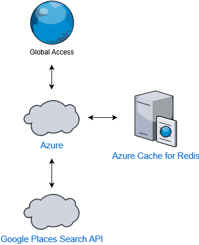

# Near By Search Web API

Simple solution hosting on [Azure](https://azure.microsoft.com/en-us/) and continuous delivery with [Azure Pipelines](https://azure.microsoft.com/en-us/services/devops/pipelines/).

---

###  Web API Project
  * [ASP.NET Core 3.1](https://dotnet.microsoft.com/download/dotnet-core/3.1)
  * [JWT Authentication API](https://github.com/cornflourblue/aspnet-core-3-jwt-authentication-api)
  * [Google Places Search API](https://developers.google.com/places/web-service/search)
  * [Azure Cache for Redis](https://azure.microsoft.com/en-us/services/cache/)
  * [StackExchange.Redis (.NET)](https://github.com/StackExchange/StackExchange.Redis)
  

---

---

Link URL: *Private Only* [Contact me](mailto:jaturapat.mee@hotmail.com?subject=[NBS]%20NBS%20Need%20URL) :)

